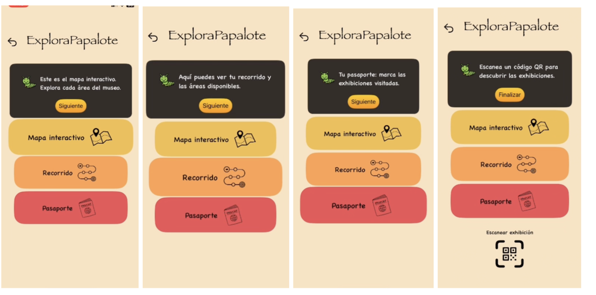
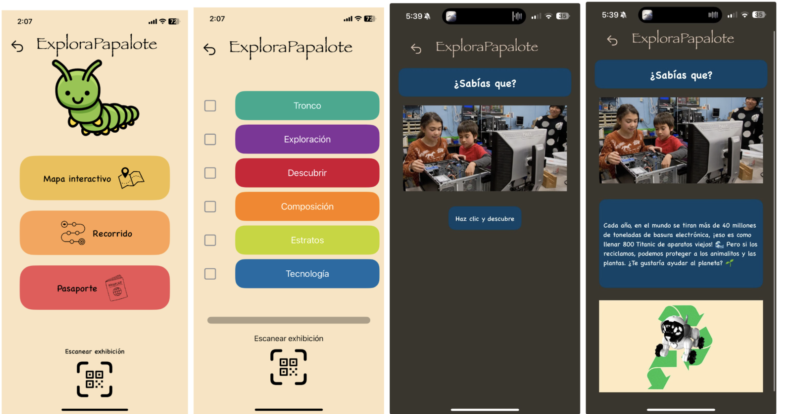

# 🎡 Explora Papalote

**Explora Papalote** is an innovative iOS application designed to enrich the visitor experience at **Papalote Museo del Niño**. By offering interactive tours and engaging activities, the app creates a unique and educational journey for both children and adults. Through gamification and advanced data analysis, visitors can personalize their experience and explore the museum in a whole new way.

---
## 📱 App Screenshots

  
  
  

  
  
  

  
  
  

  
  
  

## ✨ Key Features

### 🎮 Kid Mode
- **Gamified Experience**: Kids earn virtual stamps in a digital passport as they explore exhibits.
- **QR Code Interaction**: Scan QR codes placed around the museum to unlock fun facts, challenges, and rewards.
- **Engaging Learning**: Interactive quizzes and mini-games tailored to different exhibits to enhance learning.

### 🏛️ Adult Mode
- **Interactive Forum**: Visitors can share insights, discuss exhibits, and ask questions.
- **Personalized Recommendations**: AI-powered suggestions based on visitor preferences and past interactions.
- **In-Depth Exhibit Information**: Get expert-curated content to enhance learning and exploration.

### 📊 Data-Driven Personalization
- **AI-Powered Tour Customization**: Uses **TensorFlow** and **Supabase** to analyze visitor preferences and suggest optimal routes.
- **Real-Time Analytics**: Helps the museum refine exhibits and visitor engagement strategies.
- **Seamless Integration**: Centralized **Supabase (PostgreSQL)** database to collect, process, and analyze visitor interactions.

---

## 🛠️ Technologies Used
- **Swift** - iOS app development.
- **Supabase** - Backend with a PostgreSQL database.
- **Python/TensorFlow** - AI-powered personalization and analytics.
- **QR Code Scanner** - Enhances interaction with physical exhibits.
- **Cloud Functions** - Enables real-time data processing.

---
